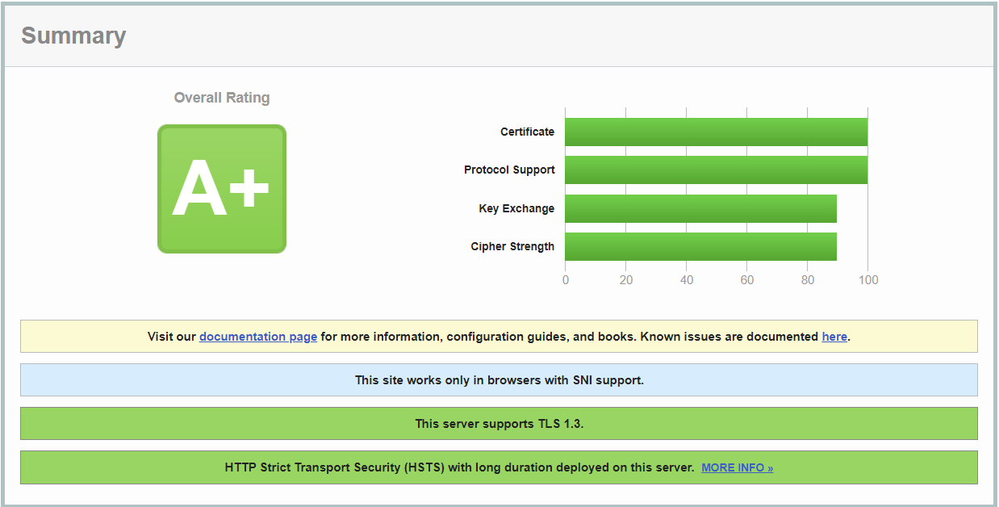

# Dockerized Nextcloud Stack with Traefik

This repository contains configuration files for deploying a Dockerized stack consisting of MySQL, Nextcloud, Redis, and Traefik. It automatically generates a Let's Encrypt certificate for the configured domain and renews it.
Follow the instructions below to set up and configure your environment.

## Prerequisites

- [Docker](https://www.docker.com/get-started)
- [Docker Compose](https://docs.docker.com/compose/install/)

## Configuration

### 1. Clone the Repository

```bash
git clone https://github.com/marcelwinh/nextcloud-https-docker.git
cd nextcloud-https-docker
```

### 2. Create the .env file
Create a copy of the .env.template file and name it .env.

```bash
cp .env.template .env
```
Edit the .env file and replace the values with your desired configuration.

### 3. Configure DNS Entries
To make your Nextcloud site accessible via a custom domain, configure DNS entries (A & AAAA records) for your domain.

A Record: Point the A record of your domain to the public IP address of your server.

```
A Record: @ -> Your_Server_IP
```
AAAA Record (Optional): If you have an IPv6 address, add an AAAA record.

```
AAAA Record: @ -> Your_Server_IPv6
```

### 4. Docker Compose Configuration
The docker-compose.yml file orchestrates the services. Ensure that the .env file values match the services' configurations.

```yml

version: '3.6'

services:
  mysql:
    # ... (MySQL configuration)

  redis:
    # ... (Redis configuration)

  nextcloud:
    # ... (nextcloud configuration)

  traefik:
    # ... (Traefik configuration)
```

## Usage
### 1. Start the Stack:

Run the following command to start the stack in the background:

```bash
docker compose up -d
```

### 2. Access Your Nextcloud Site:

Open your web browser and navigate to the specified domain in the .env file (e.g., http://my-domain.tld). Your Nextcloud site should be accessible.

### 3. Traefik Dashboard:

Traefik's dashboard is available at http://<YOUR_IP>:8080. Monitor and manage your services from there.

## Customization
Adjust MySQL, Nextcloud, Redis, and Traefik configurations in the .env file to suit your preferences and environment.
Customize the Nextcloud site domain, version, and other settings in the .env file.

## Maintenance
### Stop the Stack:

```bash
docker compose down
```
### Backup
Creating a backup for your Dockerized Nextcloud stack involves preserving the configurations, data, and volumes associated with your services. Here's a guide on which folders to save:

#### 1. **Docker Compose Configuration:**
   - Save your `docker-compose.yml` file, which contains the configuration for your services.

   ```bash
   cp docker-compose.yml /path/to/backup
   ```

#### 2. **Environment Variables:**
   - Save your `.env` file, which contains environment variables for your services.

   ```bash
   cp .env /path/to/backup
   ```

#### 3. **Nextcloud Config & Data:**
   - Save the directory specified in the `NEXTCLOUD_DATA_DIR` variable in your `.env` file. This directory contains Nextcloud site data, plugins, themes, and uploads.

   ```bash
   cp -r ./nextcloud /path/to/backup
   ```

#### 4. **MySQL Data:**
   - Save the directory specified in the `MYSQL_DATA_DIR` variable in your `.env` file. This directory contains MySQL database data.

   ```bash
   cp -r ./mysql /path/to/backup
   ```

#### 5. **Traefik Configuration (Optional):**
   - Save the Traefik configuration and Let's Encrypt certificates if they are outside of the Docker volumes.

   ```bash
   cp -r ./letsencrypt /path/to/backup
   ```

#### Creating a Tar Archive:

To create a compressed backup archive of these folders, you can use the following command:

```bash
tar -czvf backup.tar.gz /path/to/backup
```

Replace `/path/to/backup` with the actual path where you want to store your backup.

#### Restoring from Backup:

To restore your stack from the backup, copy the backup archive to your server and extract it:

```bash
tar -xzvf backup.tar.gz -C /
```

Make sure to update your configurations and environment variables as needed before restarting your Docker stack.

Remember to perform backups regularly and store them in a secure location. Adjust the backup strategy based on your deployment's critical data and update frequency.


## Security Reports
### SSL Labs Assessment Summary

#### Overall Rating: A+



The [SSL Labs](https://www.ssllabs.com/ssltest/) assessment for this server resulted in an overall rating of A+, indicating a high level of security and adherence to best practices.

**Disclaimer: This assessment represents the current state and may change in the future. It's recommended to regularly check and update your server configurations to maintain optimal security.**

### Nextcloud Security Scan

#### Overall Rating: A+


The [Nextcloud Security Scan](https://scan.nextcloud.com/) assessment for this server resulted in an overall rating of A+, indicating a high level of security and adherence to best practices.

**Disclaimer: This assessment represents the current state and may change in the future. It's recommended to regularly check and update your server configurations to maintain optimal security.**

## Exposed Ports

### Traefik Service:

- **Port 80 (HTTP):**
  - Exposes the standard HTTP port for incoming web traffic.

- **Port 443 (HTTPS):**
  - Exposes the standard HTTPS port for secure web traffic.

- **Port 8080(DEBUG ONLY):**
  - Exposes the Traefik dashboard for monitoring and managing services.

### MySQL Service:

- No specific ports are exposed to the host machine. MySQL communication is internal.

### Redis Service:

- No specific ports are exposed to the host machine. Redis communication is internal.

### Nextcloud Service:

- No specific ports are exposed to the host machine. Nextcloud communication is internal.

These port configurations are designed to enhance security by limiting direct exposure to services. Traefik acts as a reverse proxy, managing external access to the internal services while providing additional features such as load balancing and SSL termination.


# Links to the docs:

- [MySQL](https://hub.docker.com/_/mysql)
- [Nextcloud](https://hub.docker.com/_/nextcloud)
- [Redis](https://hub.docker.com/_/redis)
- [Traefik](https://hub.docker.com/_/traefik)
- [Let's Encrypt](https://letsencrypt.org/de/)


Happy Dockerizing!